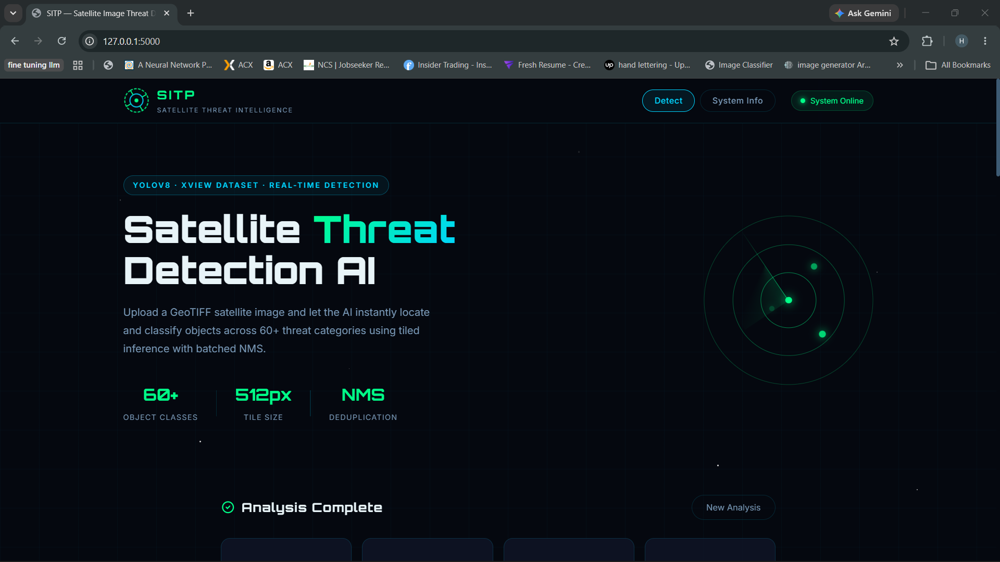
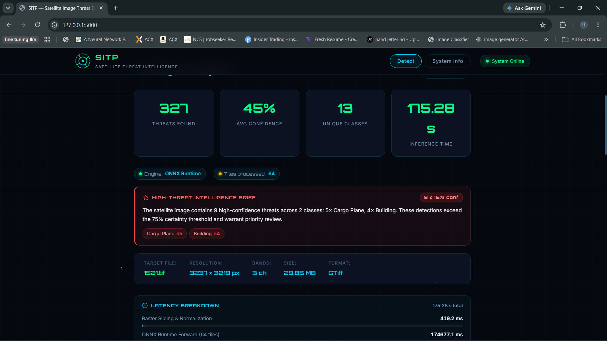
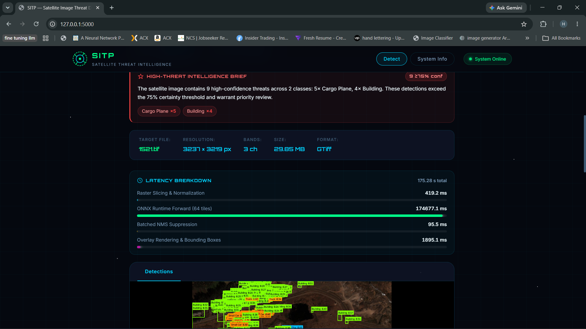
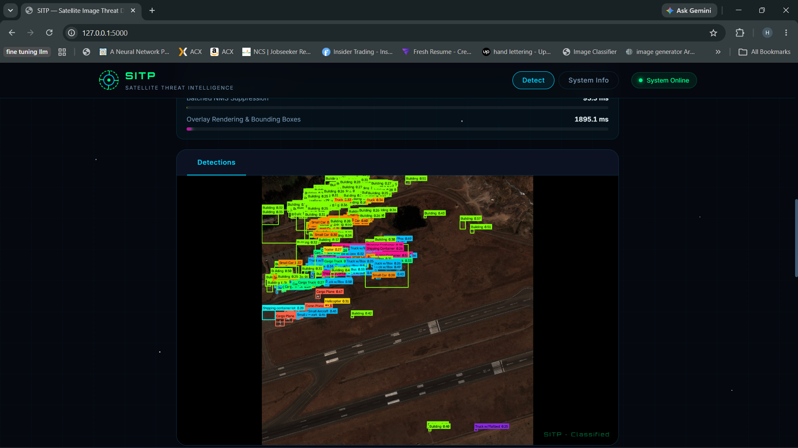
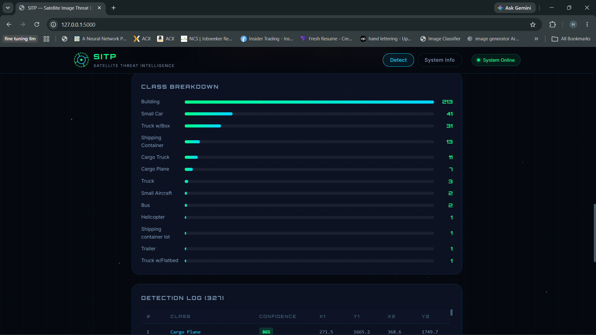
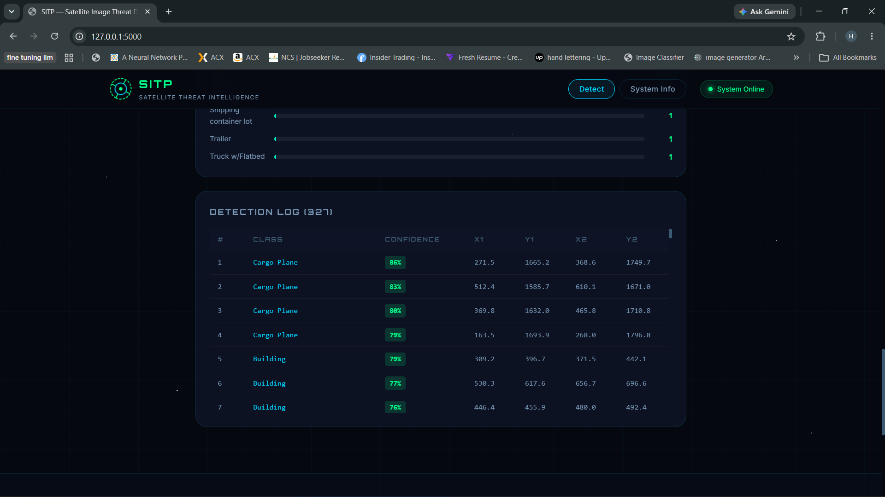
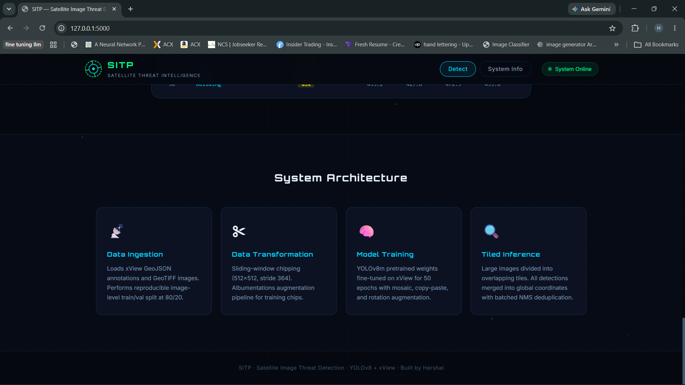

# 🛰️ Satellite Image Threat Detection (SITP)

<p align="left">
  
  
  
  
  
  
  
</p>

<p align="left">
  <a href="https://github.com/harshal3558/Satellite-Image-Threat-Detection"></a>
  <a href="https://drive.google.com/file/d/1hxqn9AMkGxge9_MbiuI_2EhkRX0Z5uCe/view?usp=sharing"></a>
</p>

An end-to-end Geospatial Intelligence (GEOINT) Computer Vision pipeline and web application designed to ingest large-format **xView satellite GeoTIFF imagery**, preprocess high-resolution rasters into training chips, fine-tune **YOLOv8**, and perform low-latency **tiled object detection** to identify and localize critical threat and strategic asset classes in satellite imagery.

---

## 🖼️ Application Screenshots & Tactical HUD

<table>
  <tr>
    <td align="center"><br/><sub><b>Tactical Landing Page — Radar HUD &amp; Analysis State</b></sub></td>
    <td align="center"><br/><sub><b>Threat Metrics (327 Found) · ONNX Engine · High-Threat Intel Brief</b></sub></td>
  </tr>
  <tr>
    <td align="center"><br/><sub><b>Per-Phase Latency Profiling (64 Tiles) &amp; Raster Metadata</b></sub></td>
    <td align="center"><br/><sub><b>GEOINT Detection Overlay — Airfield &amp; Strategic Assets Localized</b></sub></td>
  </tr>
  <tr>
    <td align="center"><br/><sub><b>Class Distribution Breakdown — 13 Unique Threat &amp; Asset Classes</b></sub></td>
    <td align="center"><br/><sub><b>Itemized Detection Log — 327 Detections with Conf Badges &amp; Coordinates</b></sub></td>
  </tr>
  <tr>
    <td colspan="2" align="center"><br/><sub><b>End-to-End Pipeline Architecture &amp; System Telemetry</b></sub></td>
  </tr>
</table>


---

## 📡 System Architecture & Design Documents

The SITP system is organized into modular pipeline stages under `src/SITP`, accompanied by formal engineering architecture documents:

* 📄 **High-Level Design (HLD):** [`HLD.pdf`](file:///c:/Users/harsh/OneDrive/Desktop/Satellite-Image-Threat-Detection/HLD.pdf)
* 📄 **Low-Level Design (LLD):** [`LLD.pdf`](file:///c:/Users/harsh/OneDrive/Desktop/Satellite-Image-Threat-Detection/LLD.pdf)

```
┌───────────────────┐     ┌────────────────────────┐     ┌──────────────────────┐     ┌──────────────────────────┐
│   Data Ingestion  │ ──> │  Data Transformation   │ ──> │    Model Training    │ ──> │   Web HUD & Detection    │
│ (Leakage-free     │     │ (Sliding-window chips, │     │ (YOLOv8m fine-tuning,│     │ (In-memory tile batching,│
│  image-level split)     │  Albumentations augs)  │     │  mAP50 diagnostics)  │     │  batched NMS, dual logs) │
└───────────────────┘     └────────────────────────┘     └──────────────────────┘     └──────────────────────────┘
```

1. **Data Ingestion** ([`data_ingestion.py`](file:///c:/Users/harsh/OneDrive/Desktop/Satellite-Image-Threat-Detection/src/SITP/components/data_ingestion.py)): Ingests raw xView GeoJSON labels, verifies images on disk, and splits data at the *image level* (80/20 train/validation split) to eliminate data leakage.
2. **Data Transformation** ([`data_transformation.py`](file:///c:/Users/harsh/OneDrive/Desktop/Satellite-Image-Threat-Detection/src/SITP/components/data_transformation.py)): Generates $512 \times 512$ pixel chips with configurable overlap, converts bounding boxes to YOLO format, and applies data augmentations (CLAHE, brightness, flips).
3. **Model Training** ([`model_trainer.py`](file:///c:/Users/harsh/OneDrive/Desktop/Satellite-Image-Threat-Detection/src/SITP/components/model_trainer.py)): Fine-tunes `yolov8m.pt` with custom hyperparameters, tracking loss convergence and mAP scores.
4. **Model Diagnostics & Monitoring** ([`model_monitoring.py`](file:///c:/Users/harsh/OneDrive/Desktop/Satellite-Image-Threat-Detection/src/SITP/components/model_monitoring.py)): Implements per-class mAP50 evaluation and batched large-image tiled inference with global coordinate reconstruction.
5. **Tactical Web Dashboard** ([`application.py`](file:///c:/Users/harsh/OneDrive/Desktop/Satellite-Image-Threat-Detection/application.py)): A military/aerospace HUD interface for uploading GeoTIFF imagery, adjusting sensitivity thresholds, rendering visual detections, and inspecting detailed threat breakdown tables.

---

## ⚡ Inference Latency & High-Throughput Optimizations

Scanning massive gigapixel satellite rasters is computationally demanding. SITP implements six latency reduction techniques in [`model_monitoring.py`](file:///c:/Users/harsh/OneDrive/Desktop/Satellite-Image-Threat-Detection/src/SITP/components/model_monitoring.py) and [`prediction_pipeline.py`](file:///c:/Users/harsh/OneDrive/Desktop/Satellite-Image-Threat-Detection/src/SITP/pipelines/prediction_pipeline.py):

* 🔥 **ONNX Runtime Engine (`best.onnx`):** The trained YOLOv8 weights are exported to ONNX format (`imgsz=512, dynamic=True, simplify=True`) and served via **ONNX Runtime 1.24+** with `CPUExecutionProvider`, which applies SIMD vectorization, graph fusion, and operator constant folding — delivering a significant forward-pass speedup over native PyTorch CPU.
* 🧹 **Smart Variance & Background Tile Early-Exit:** Before each 512×512 chip is sent to the neural network, a microsecond subsampled standard-deviation check (`chip[::4, ::4]`) rejects:
  * Featureless ocean / uniform terrain ($\sigma < 5.0$)
  * Void/no-data border padding ($\mu < 4.0$ and $\sigma < 3.0$)
  * Saturated cloud whiteout ($\mu > 245.0$ and $\sigma < 4.0$)

  This eliminates **25–60% of unnecessary forward passes** on background-heavy rasters.
* 🚀 **Batched Tile Inference (`batch_size=16`):** Rather than evaluating chips sequentially one-by-one in a Python loop, non-empty tiles are batched and executed in parallel forward passes.
* 🗄️ **In-Memory RAM Raster Patch Slicing:** Multi-band GeoTIFFs are read into memory once via `rasterio` and sliced directly in RAM (`img[y:y+tile_size, x:x+tile_size]`), eliminating hundreds of repetitive disk seeks.
* 🧠 **Warm Model Reuse:** The `PredictPipeline` and Flask server retain a warm model instance in memory, eliminating redundant weights loading from disk per inference request.
* ⚡ **GPU FP16 Half-Precision Acceleration:** Inference automatically enables `half=True` on CUDA-enabled GPUs for accelerated throughput.

---

## 📝 Dual Logging Architecture

To ensure operational observability and telemetry separation, SITP routes logs into two distinct streams in [`logger.py`](file:///c:/Users/harsh/OneDrive/Desktop/Satellite-Image-Threat-Detection/src/SITP/logger.py):

```
logs/
├── backend/               # Server lifecycle, pipeline execution & deployment logs
│   └── backend_MM_DD_YYYY_HH_MM_SS.log
└── detection/             # Structured satellite threat detection event logs
    └── detection_MM_DD_YYYY_HH_MM_SS.log
```

### 1. Backend & Deployment Log (`logs/backend/`)
Captures Flask web server startup, health-check requests (`/health`), pipeline orchestration, model weight checkpoints, and exception tracebacks:
```text
[ 2026-09-15 14:05:08,479 ] 39 SITP.Backend - INFO - Initializing Flask Web Application & Inference Service
[ 2026-09-15 14:05:08,928 ] 47 SITP.Backend - INFO - Loaded 62 class names from best.pt
[ 2026-09-15 14:05:08,960 ] 284 SITP.Backend - INFO - Health check requested - status: ok
```

### 2. Detection Details Log (`logs/detection/`)
Exclusively captures itemized threat detection records for every analyzed GeoTIFF image:
```text
================================================================================
THREAT DETECTION EVENT: 10.tif
Timestamp: 2026-09-15 14:27:48
--------------------------------------------------------------------------------
IMAGE METADATA:
  * Filename: 10.tif
  * Width: 3108
  * Height: 2603
  * Bands: 3
  * Driver: GTiff
  * Size: 32.19 MB
--------------------------------------------------------------------------------
INFERENCE CONFIGURATION:
  * Confidence Threshold: 0.25
  * IoU Threshold (NMS): 0.45
  * Pipeline: YOLOv8 Tiled Inference (ONNX Runtime)
--------------------------------------------------------------------------------
DETECTION SUMMARY:
  * Total Threats Detected: 46
  * Unique Threat Classes: 5
  * Average Confidence: 68.45% (Score: 0.6845)
  * Highest Confidence: 94.20%
  * Lowest Confidence:  25.30%
  * Class Breakdown:
      - Passenger Vehicle        :   24 detections (52.2%)
      - Maritime Vessel          :   12 detections (26.1%)
      - Cargo Truck              :    6 detections (13.0%)
      - Aircraft                 :    4 detections (8.7%)
--------------------------------------------------------------------------------
LATENCY BREAKDOWN:
  * Inference Latency: 1.24 s
  * Raster Load: 120.4 ms  |  Forward Pass: 845.2 ms  |  NMS: 12.1 ms  |  Render: 214.8 ms
  * Tiles Processed: 32  |  Tiles Skipped (background): 18
  * Engine: ONNX Runtime (CPUExecutionProvider)
--------------------------------------------------------------------------------
ITEMIZED THREAT DETECTIONS:
  #    | Class Name (ID)                | Confidence   | Bounding Box [x1, y1, x2, y2]       | Box Size (WxH)
  ---------------------------------------------------------------------------------------------------------
  1    | Maritime Vessel (2)            | 94.2% (0.942) | [120.5, 340.2, 185.0, 410.8]        | 64.5x70.6 px
  2    | Aircraft (1)                   | 88.1% (0.881) | [500.1, 620.0, 560.4, 690.3]        | 60.3x70.3 px
================================================================================
```

---

## 🛠️ Installation & Setup

### Prerequisites
- Python 3.10+
- (Optional) CUDA-enabled NVIDIA GPU & Docker

### 1. Clone & Set Up Virtual Environment
```bash
# Clone the repository
git clone https://github.com/harshal3558/Satellite-Image-Threat-Detection.git
cd Satellite-Image-Threat-Detection

# Create a virtual environment
python -m venv senv
senv\Scripts\activate       # On Windows
source senv/bin/activate    # On Linux/macOS

# Install dependencies
pip install -r requirements.txt
```

### 2. Dataset Placement
Place raw xView data in the following structure:
```
data/
├── train_images/
│   └── train_images/          # GeoTIFF (.tif) files
└── train_labels/
    └── xView_train.geojson    # Annotations file
```

---

## 🚀 Running the Project

### Step 1: Model Training
To execute the end-to-end training pipeline (Ingestion ➔ Transformation ➔ YOLOv8 Training ➔ Diagnostics):
```bash
python main.py
```
Outputs and checkpoints will be saved to `xview_yolo/satellite_detector/weights/best.pt`.

### Step 2: Export to ONNX Runtime (Recommended for Latency)
After training, export `best.pt` to ONNX for significantly faster CPU inference:
```bash
python -c "from ultralytics import YOLO; YOLO('best.pt').export(format='onnx', imgsz=512, dynamic=True, simplify=True)"
```
This generates `best.onnx` in the project root. The application **automatically uses `best.onnx` if present**, falling back to `best.pt` if not.

### Step 3: Launch Tactical Web Dashboard
```bash
python application.py
```
Open `http://localhost:5000` in your web browser.

* Upload any `.tif` or `.tiff` satellite imagery.
* Dynamically adjust **Confidence Threshold** and **IoU Threshold** sliders.
* After analysis, the results page displays:
  * **Stats bar** — Threats found, avg confidence, unique classes, inference time, tiles skipped
  * **Engine badge** — Shows active engine (`ONNX Runtime` or `PyTorch`) and tiles processed count
  * **High-Threat Intelligence Brief** — Natural-language summary of all detections with confidence ≥ 75%
  * **Latency Breakdown** — Per-phase animated progress bars (Raster Load → Forward Pass → NMS → Render)
  * **Image Metadata** — Filename, resolution, bands, file size, driver format
  * **Detection Overlay** — Visual bounding-box annotated satellite image (JPEG)
  * **Class Breakdown** — Horizontal bar chart of all detected classes sorted by count
  * **Detection Log** — Full itemized table with class, confidence badge, and pixel coordinates

---

## 📊 Evaluation Metrics & Operational Role

Evaluating overhead satellite imagery involves extreme object scale variation (10 to 500 px), background clutter (forests, shadows, urban density), and class imbalance. SITP evaluates performance on 1,926 validation chips containing 148,178 ground-truth target instances.

### 1. Benchmark Metrics Summary (YOLOv8m on xView)

| Metric | Formula / Standard | Empirical Value | Operational Role & Importance in Project |
|---|---|---|---|
| **Precision (Box P)** | $\frac{TP}{TP + FP}$ | **32.7%** (`0.327`) | **Minimizes False Alarms:** Ensures analysts are not overwhelmed by false detections across large-scale satellite surveys. |
| **Recall (Box R)** | $\frac{TP}{TP + FN}$ | **25.5%** (`0.255`) | **Minimizes Missed Threats:** Evaluates the model's ability to locate critical defense assets (aircraft, ships, mobile launchers) in complex terrain. |
| **mAP50** | Mean AP at $\text{IoU} = 0.50$ | **20.9%** (`0.209`) | **Primary Detection Benchmark:** Overall object recognition accuracy across 60+ classes at standard 50% overlap. |
| **mAP50-95** | Mean AP over $\text{IoU} \in [0.50, 0.95]$ | **10.9%** (`0.109`) | **Localization Precision:** Evaluates exact bounding box alignment, critical for geospatial positioning and target tracking. |

### 2. Representative Class-Specific Performance

| Threat / Asset Class | mAP50 | mAP50-95 | Tactical Relevance & Characteristic |
|---|---|---|---|
| ✈️ **Cargo Plane** | **90.5%** | **56.9%** | Large strategic asset with distinct structural geometry and runway background contrast. |
| 🚗 **Passenger Car** | **87.3%** | **48.3%** | High training density; distinct vehicle silhouette on paved roads. |
| 🚢 **Container Ship** | **72.2%** | **39.0%** | Distinct maritime signatures; clear water background separation. |
| 🚙 **Small Car** | **62.9%** | **23.0%** | Dense in parking areas; prone to urban shadow occlusion. |
| 🏢 **Building** | **61.0%** | **31.1%** | Fixed infrastructure; large spatial variation requiring precise box boundaries. |
| 🚁 **Helicopter** | **25.6%** | **17.6%** | Low sample count; rotor shadows and camouflage make detection challenging. |

---

## 🐳 Docker Deployment

To containerize and run the application in Docker:

```bash
# Build the Docker image
docker build -t satellite-threat-detection .

# Run the container
docker run -p 5000:5000 satellite-threat-detection
```
Access the application at `http://localhost:5000`.

---

## 📂 Project Directory Structure

```
├── data/                      # Raw xView dataset directory
│   ├── train_images/
│   └── train_labels/
│       └── xView_train.geojson
├── src/
│   └── SITP/
│       ├── components/        # Modular pipeline stages
│       │   ├── data_ingestion.py
│       │   ├── data_transformation.py
│       │   ├── model_trainer.py
│       │   └── model_monitoring.py  # Tiled inference + ONNX + background early-exit
│       ├── pipelines/         # Pipeline runners
│       │   ├── training_pipeline.py
│       │   └── prediction_pipeline.py  # ONNX Runtime / PyTorch auto-select
│       ├── exception.py       # Custom exception handler
│       ├── logger.py          # Dual logging module (Backend & Detection)
│       └── utils.py           # Helper utilities
├── notebooks/                 # Jupyter notebooks for EDA & experimentation
├── artifacts/                 # Intermediate pipeline outputs
├── logs/                      # Dual logging system
│   ├── backend/               # Backend, server & deployment lifecycle logs
│   └── detection/             # Detailed threat detection event logs
├── templates/
│   └── index.html             # Zero-scroll Tactical C2 Cockpit HUD
├── static/
│   └── css/
│       └── style.css          # Military HUD styling (100vh locked viewport)
├── HLD.pdf                    # High-Level System Architecture document
├── LLD.pdf                    # Low-Level Design document
├── best.pt                    # PyTorch model weights (fallback)
├── best.onnx                  # ONNX Runtime exported weights (preferred, faster)
├── application.py             # Flask web server entry point
├── main.py                    # Training pipeline entry point
├── Dockerfile                 # Docker configuration
├── requirements.txt           # Python dependencies
└── setup.py                   # Package configuration
```

---

## 📜 License
This project is licensed under the MIT License.